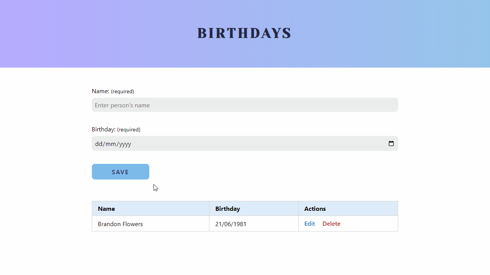
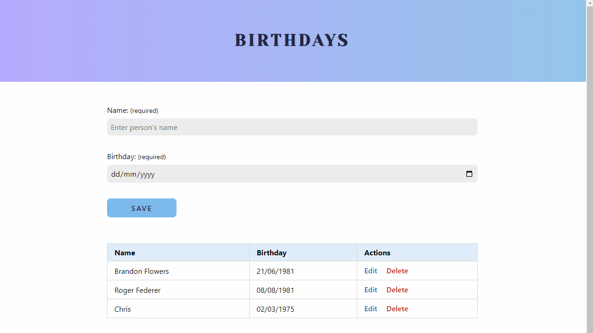

# Birthdays List

This project is a birthdays list application created using CRUD (Create, Read, Update, Delete) operations and developed with HTML, CSS/SASS, and JavaScript.

Concepts practiced: DOM Manipulation, Events, Local Storage, Constraint Validation API, Regex, ES6 Modules.

This project is part of the [7 Days Of Code](https://7daysofcode.io/) Challenge by Alura, a Brazilian learning platform.

## 🔗 Link

- [Live Demo](https://julianachagas.github.io/birthdays-list)

## 🛠️ Technologies

- HTML
- CSS
- SASS
- JavaScript

## 💡 Features

- Create a new entry: enter the name of the person and birthday using the form
- Data is stored in local storage
- Read: user has access to the entries in the UI
- Update: edit entry
- Delete: delete entry from the UI and local storage
- Message when input is invalid

## 💻 Demo

- Create and Read

   

- Update and Delete

   

## 📚 Resources

- CRUD Operations: [article on freeCodeCamp](https://www.freecodecamp.org/news/crud-operations-explained/)
- "Is the Javascript date object always one day off?": [StackOverflow](https://stackoverflow.com/questions/7556591/is-the-javascript-date-object-always-one-day-off)

## 👩🏻‍💻 Author

---

##### Made with 💜 by Juliana Chagas
